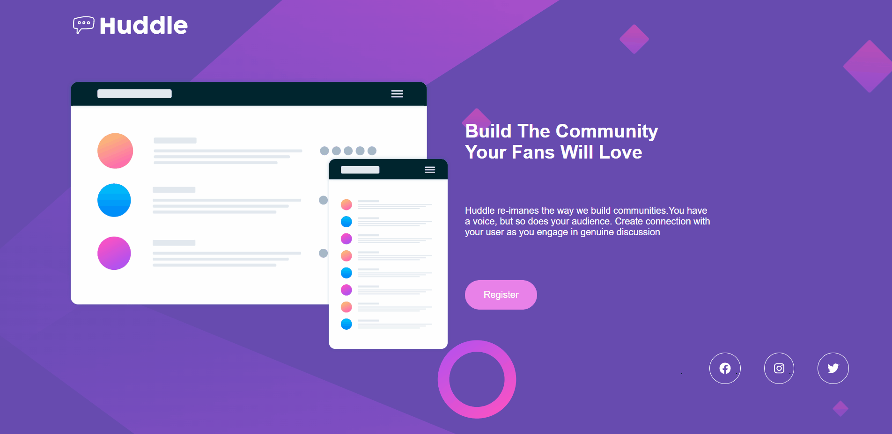
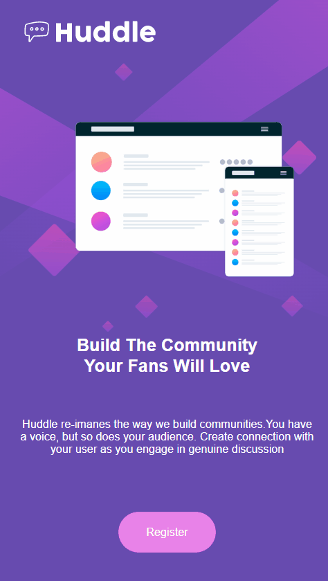

# Huddle Page Quest

Aprimorando cada vez mais meu html e css responsivo, dessa vez na quest do curso DevQuest pude fazer do 0 e sem alguma consulta.

 

## Projeto

---

 

## Mobile

---

 

## Tecnologias Utilizadas

---

 
  
  

 

## Link Hospedado no GitHub pages

---
